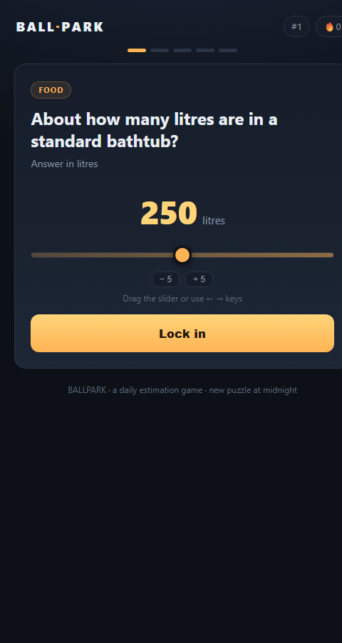
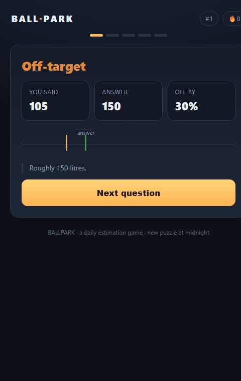
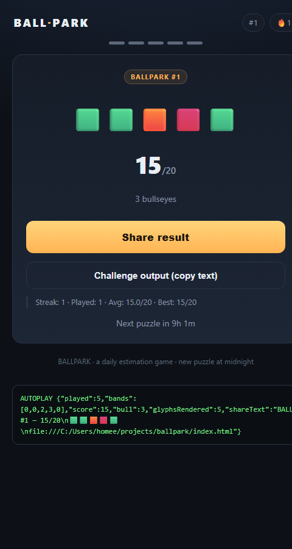
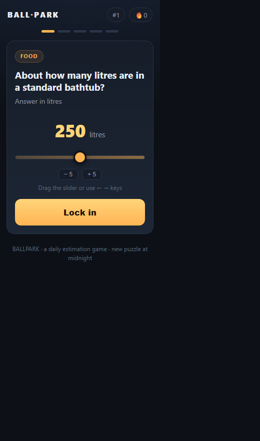

# BALLPARK

**The daily estimation game.** Five questions a day. Estimate each answer on a slider, find out how close you got — then challenge a friend *without* spoiling it.

### ▶ **[Play it live → nwfella.github.io/ballpark](https://nwfella.github.io/ballpark/)**



`single file` · `zero dependencies` · `no build step` · `no server` · `MIT` · ~52 KB

---

## What it is

BALLPARK is a daily puzzle in the spirit of Wordle, but for your numerical intuition instead of your vocabulary. Every day, everyone gets the **same five estimation questions** — "How many countries are in Africa?", "How many bones are in the adult human body?", "How many minutes are in a year?" — and scores points for how close they land.

One session takes two to three minutes. Then you share a compact, **spoiler-free** result and come back tomorrow.

## How to play

1. **Five questions a day**, resetting at your local midnight.
2. **Drag the slider** (or use the ← → arrow keys, or the step buttons) to your best estimate.
3. **Lock in** to reveal the true answer and how far off you were.
4. **Share** your result as a row of colored bands — no answers leaked — and challenge a friend.
5. Keep your **streak** alive by playing each day.

### Scoring

Each answer falls into one of four bands, measured as relative error against the true value (with an absolute floor of 10, so small answers like "3" aren't unfairly punishing):

| Band | How close | Name | Points |
|:---:|---|---|:---:|
| 🟩 | within 10% | Bullseye | 4 |
| 🟨 | within 25% | Close | 3 |
| 🟧 | within 50% | Off-target | 2 |
| 🟥 | beyond that | Way off | 1 |

Five questions → a score out of 20. "Three bullseyes" is a good day.

## Screenshots

| Playing | Reveal | Result |
|---|---|---|
|  |  |  |

Responsive down to small phones (no horizontal overflow at 320 px):



---

## Why it's built this way

Two design decisions make this more than a Wordle reskin.

### 1. The share artifact is *lossy* by design

The shared result is a row of colored bands, never the values:

```
BALLPARK #1 — 15/20
🟩🟩🟧🟥🟩
```

A friend sees *how well you did*, not *what the answers were*. Knowing "round 3 was off-target" tells them almost nothing about the true number, so the post is safe to share anywhere and still makes them want to play.

This is the reason the game is an **estimation** game rather than a **higher/lower** game. In higher/lower, the per-round outcome is binary (⬆️/⬇️) — and a row of ⬆️⬇️ *fully leaks the answer sequence*, so a daily higher/lower game can never have a safe shared artifact. Estimation has a huge answer space, so a lossy artifact stays lossy. Lossiness is what makes the growth loop work.

### 2. Zero content treadmill

A daily puzzle normally means authoring a new puzzle **every single day, forever** — an ongoing cost that kills solo projects. BALLPARK sidesteps this entirely: the daily set is **generated deterministically from a bundled question bank** using a date-seeded PRNG (`mulberry32`). The same seed gives everyone the same five questions, with no curation or infrastructure required. Grow the bank and the puzzle variety grows with it.

### The growth loop

Every hook is aimed at the one metric that matters — does a player bring another player?

- **Same puzzle for everyone, daily** → a shared conversation is the fuel.
- **Spoiler-free artifact** → safe to post in any group chat.
- **Day number** (`#1`, `#2`, …) → urgency and FOMO.
- **`navigator.share`** → one tap to the native share sheet on mobile (WhatsApp / iMessage / Signal); clipboard fallback on desktop.
- **Streak counter** → a reason to return and not break the chain.
- **Countdown to the next puzzle** → a return trigger.

## Features

- 🗓️ **Daily puzzle** — deterministic, identical for everyone, resets at local midnight.
- 🎯 **Estimation scoring** with four bands and an absolute floor for small answers.
- 📊 **Spoiler-free share** via the native share sheet, with clipboard fallback.
- 🔥 **Streaks and lifetime stats** (played, average, best) persisted in `localStorage`.
- 📱 **Responsive** — works from a 320 px phone to desktop, keyboard and touch friendly.
- 🧩 **Deterministic bank** — no server, no database, no daily authoring.
- 🪶 **Single file, zero dependencies** — no framework, no build step, no CDN.

## Tech

Everything lives in **`index.html`** — markup, styles, and logic in one file. There is no build step, no bundler, no package manager, and no external requests. Open the file and it runs.

- **Daily generation:** date → day index → `mulberry32` seeded shuffle → first five questions.
- **Scoring:** `err = |guess − answer| / max(answer, 10)`, then banded at 10% / 25% / 50%.
- **Persistence:** `localStorage` (`ballpark_v1` key) — streak, lifetime stats, and today's result (so a refresh can't replay the day).
- **Sharing:** `navigator.share` → clipboard fallback → `execCommand` fallback.

## Run it locally

```bash
git clone https://github.com/nwfella/ballpark.git
cd ballpark
# just open it:
start index.html             # Windows
# or serve it:
python -m http.server 8000   # then visit http://localhost:8000
```

## Testing

The checks are **built into the page**, so there's no test runner and no Node required. Append a query string:

| URL | What it does |
|---|---|
| `?selftest=1` | 1,430 assertions — bank integrity (integer answers inside their ranges, no answer sitting on a slider edge, real reveal notes, **no duplicate questions**), daily determinism and variety, scoring bands, share-text shape, and a **no-leak** check that the share text never contains answers. Sets the page `<title>` to `SELFTEST PASS`/`FAIL`. |
| `?autoplay=1` | Plays all five rounds programmatically and renders the result card — a full-loop smoke test. |
| `?reveal=1` | Locks in one answer so you can inspect the reveal screen. |
| `?metrics=1` | Writes viewport / scroll widths to `<title>` for responsive-overflow checks. |

Headless verification (Chrome):

```bash
chrome --headless=new --dump-dom --virtual-time-budget=5000 \
  "file:///…/index.html?selftest=1" | grep -o '<title>[^<]*</title>'
# -> <title>SELFTEST PASS (1430 checks)</title>

chrome --headless=new --dump-dom --virtual-time-budget=5000 \
  "file:///…/index.html?autoplay=1" | grep -o 'AUTOPLAY [^<]*'
# -> AUTOPLAY played=5 score=15 glyphs=5
```

> **Note:** headless Chrome clamps its viewport to a **512 px minimum**, so `--window-size=320` silently renders at 512 and crops. To test genuinely narrow layouts, measure inside a fixed-width `<iframe>` (see `?metrics=1`) rather than trusting a narrow headless screenshot.

## Deploying

Static single-file site on GitHub Pages:

```bash
gh repo create ballpark --source . --public --push
gh api repos/nwfella/ballpark/pages -X POST --input - <<'EOF'
{"source":{"branch":"main","path":"/"}}
EOF
```

## The question bank

The bank lives in the `QUESTIONS` array at the top of the script block in `index.html`. Each entry is:

```js
{ c: "Geography", q: "How many countries are in Africa?", u: "countries", a: 54, min: 0, max: 120, n: "54 sovereign states, per the UN." }
//  category        question                                unit label      answer  slider range      reveal note
```

To add a question:

1. Keep `a` inside `[min, max]`, and set `min`/`max` wide enough that the answer's position doesn't give it away.
2. Write a genuine `n` (reveal note) — not just the bare number.
3. Run `?selftest=1`; it enforces all of the above.

The bank currently holds **235 questions** across 13 categories — five a day, so a **47-day rotation**. It is maintained by two scripts in `scripts/`:

| Script | Purpose |
|---|---|
| `scripts/questions_new.py` | The batch definition — one tuple per candidate question. |
| `scripts/build_bank.py` | Merges candidates into `index.html` between `/* BANK:START */` and `/* BANK:END */`, dedupes, normalises category labels, and applies a corrections table. Idempotent and self-healing — re-running is always safe. |
| `scripts/audit_bank.py` | Flags weak reveal notes (e.g. a bare number like `42.`). |

```bash
python scripts/build_bank.py     # merge + apply corrections
python scripts/audit_bank.py     # report weak notes (expect 0)
# then: ?selftest=1 must PASS before you commit
```

**Rules the batch followed — and the gate now enforces:**

1. **Integer answers only.** The slider steps by whole numbers, so a fractional true answer (2.54) is unreachable and the revealed answer would be a rounding, not a fact.
2. **No answer on a slider edge.** If the true value equals the slider minimum or maximum, a player wins by slamming the slider to one end. This retired two otherwise-good questions — *"0 moons on Venus"* and *"0 bones in a shark"*.
3. **No duplicate questions** (normalised-text check across the whole bank).

**Stable facts only:** unit conversions, fixed counts, and settled history. **No** "tallest / richest / current record / current population" items — those expire and would silently become wrong answers. Contested figures are excluded too: a question about how many countries the equator crosses was cut, because the honest answer is 11 on land or 13 including territorial waters, and a daily game must not display a "true" answer that is genuinely argued about.

> ⚠️ **Growing the bank reshuffles every day.** The daily set is a seeded shuffle of the whole bank, so appending questions changes which questions land on *every* day index, including ones already played. Harmless while the game is new; once real players have history you want the frozen-schedule approach in the Roadmap before adding more.

## Roadmap

- [x] Expand the bank to 200+ questions across more categories. *(235 across 13 categories)*
- [ ] **Freeze a rolling schedule** before the bank grows again — adding questions currently reshuffles every day, including days already played.
- [ ] Share/copy event logging — measure whether the growth loop actually fires.
- [ ] A stats modal with a score-distribution chart.
- [ ] Optional archive / practice mode.
- [ ] Custom domain.

## License

[MIT](LICENSE) © 2026 nwfella

Built to be forked — swap the bank, restyle it, ship your own daily.
